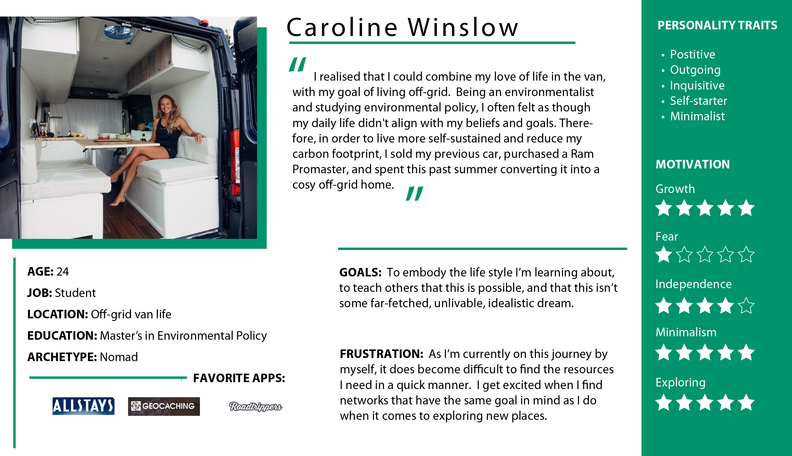

# Holiday Road from Nashville

My teamates and I were contracted by the National Parks Service to build an application that will allow people to build itineraries for their trips to the beautiful national parks that they maintain. The starting point of each trip will be Nashville, TN, but the destination will a national park selected by the user.

## Setup

Install json-server

After cloning the repository:

1. In the `scripts` directory, you will see a file named `.Settings.js` (note the dot at the beginning).
1. Copy that file with `cp .Settings.js Settings.js`. The `Settings.js` file is already in the `.gitignore` file, so it won't ever be tracked by git.
1. Register an API key for the APIs below that need it.
1. Copy each key into the appropriate place in the `Settings.js` file.

### Running the program

Open the terminal and navigate into the cloned `holiday-road-hunchbacks-of-notre-dame` directory. Once there, type `serve` to serve the application to a the browser. Open another terminal window and navigate to the `api` directory in the `holiday-road-hunchbacks-of-notre-dame` directory and type `json-server -p 8088 -w db.json`. This allows the user to add and load itinerary objects to and from the local database. 

### Building the Itinerary

* List all national parks in a dropdown. When user chooses one, display the name of the park in the **Itinerary Preview** section.

* List all bizarraries in a dropdown. When user chooses one, display the name of the bizarre attraction in the **Itinerary Preview** section.

* List all eateries in a dropdown. When user chooses one, display the name of the eatery in the **Itinerary Preview** section.

### Itinerary Details

* In the **Itinerary Preview** section, there should be a button labeled _Save Itinerary_. It should be disabled by default.
* When the user has selected a park, and the name of the park has been added to the **Itinerary Preview** section, query the Open Weather API and display the 5 day forecast for that location. This will allow the user to see if they want to make the trip soon.
* When the user adds any item to the **Itinerary Preview**, there should be a _Details_ button next to the name of the item.

* When the user clicks on any detail button for an itinerary item, a dialog box should be presented to the user with more information about that item _(description, address, etc...)_.
* Once the user has selected a park, a bizarre attraction, and an eatery, the _Save Itinerary_ button is enabled.
* When the user clicks the _Save Itinerary_ button, the chosen items should be saved as an object in your own, local API that is managed by `json-server`. Each saved itinerary should appear in an aside bar on the right side of the UI.

## National Park Service API

* API home: https://www.nps.gov/subjects/digital/nps-data-api.htm
* API documentation: https://www.nps.gov/subjects/developer/api-documentation.htm

### List All Parks

https://developer.nps.gov/api/v1/parks?api_key=your_api_key

## Weather API

https://openweathermap.org/api

## Bizarre Destination

http://holidayroad.nss.team/bizarreries

## Eateries Destination

http://holidayroad.nss.team/eateries

## Tips For A Good Usable Website
1. Use acceptable conventions
   * Logo positioned at top left
   * Navigation across the top or down the left side
   * Copyright in the footer.
2. Visual hierarchy
   * Most important information is the most prominent
3. Break pages up into defined sections
   * Logically related content should be related visually
4. That which is clickable should be obviously clickable.
5. Eliminate distractions
   * Use only two typefaces
   * Limit color pallet (3 colors with black and white)
   * Use a grid
6. Support scanning (users don't read)
   * Use plenty of headings
   * Short paragraphs
   * Bulleted lists
   * Left aligned text
7. Strive for consistency.
8. Use semantic and valid HTML: validator at [https://validator.w3.org/](https://validator.w3.org/).

## Persona

### Caroline

